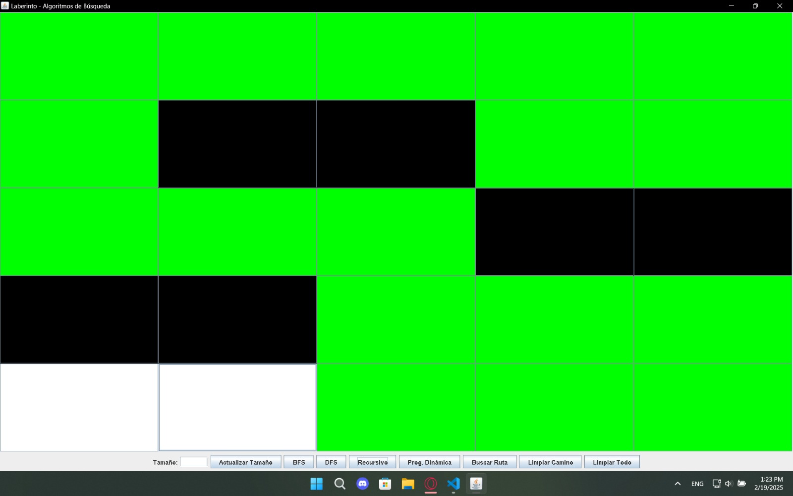
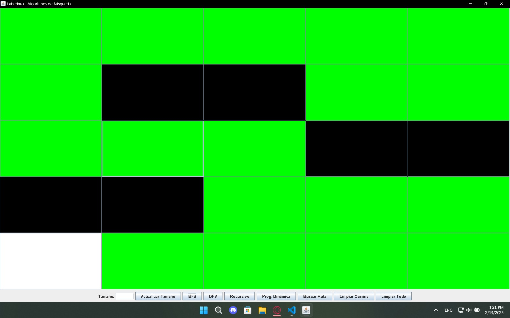
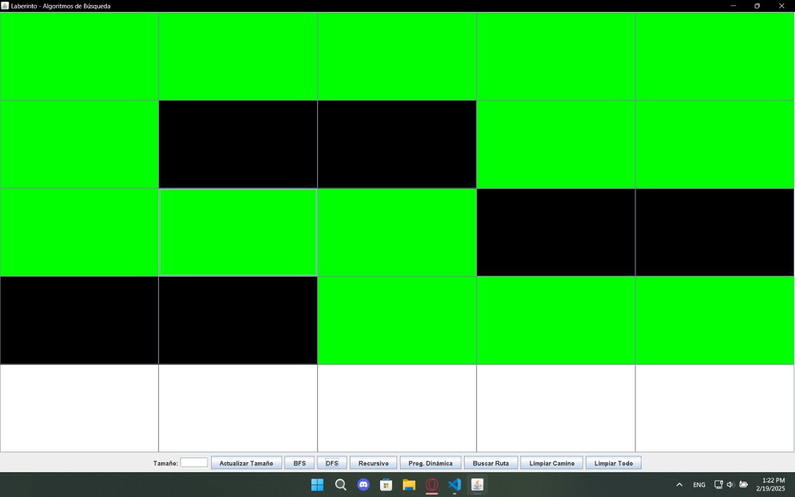

# Proyecto Final: Implementación de un Algoritmo para Encontrar la Ruta Óptima en un Laberinto

## Universidad Politécnica Salesiana 

### Carrera: Computación
### Asignatura: Estructura de Datos - Segundo Interciclo

#### Integrantes:
- Gabriel Segarra (gsegarraa1@est.ups.edu.ec)
- Alexander Ramon 

---

## 1. Objetivos

Desarrollar una aplicación que implemente un algoritmo para encontrar la ruta óptima desde un punto de inicio (A) hasta un punto de destino (B) en un laberinto, utilizando conceptos avanzados de programación dinámica y estructuras de datos lineales y no lineales.

## 2. Descripción del Problema

El problema consiste en encontrar la ruta óptima desde un punto de inicio (A) hasta un punto de destino (B) en un laberinto definido como una matriz de celdas, donde cada celda puede ser transitable o no transitable. Se requiere implementar al menos cuatro métodos diferentes para encontrar esta ruta y compararlos.

## 3. Propuesta de Solución

### Marco Teórico

- **Programación Dinámica**: Técnica de optimización que permite resolver problemas dividiéndolos en subproblemas más pequeños y almacenando sus resultados para evitar cálculos redundantes.
- **BFS (Breadth-First Search)**: Algoritmo de búsqueda en grafos que explora todos los vecinos de un nodo antes de pasar a la siguiente profundidad.
- **DFS (Depth-First Search)**: Algoritmo de búsqueda en grafos que explora tan profundo como sea posible antes de retroceder.
- **Memoización**: Técnica de programación dinámica que almacena los resultados de subproblemas en una tabla (memoria cache) para evitar recalculaciones.

### Descripción de la Solución

La solución propuesta incluye la implementación de cuatro métodos para la búsqueda de rutas:
1. Método Recursivo Simple
2. Método Aplicando Cache (Programación Dinámica)
3. BFS (Breadth-First Search)
4. DFS (Depth-First Search)

### Herramientas y Lenguajes Utilizados

- **Lenguaje de Programación**: Java
- **Entorno de Desarrollo**: Visual Stufio Code
- **Librerías**: Java Swing para la interfaz gráfica

## 4. Implementación del Algoritmo

### Método Recursivo Simple

```java
public static boolean encontrarRutaRecursiva(Laberinto laberinto, int fila, int columna, int destinoFila, int destinoColumna, boolean[][] visitado) {
    if (fila == destinoFila && columna == destinoColumna) {
        return true;
    }

    if (!esValido(laberinto.laberinto, visitado, fila, columna)) {
        return false;
    }

    visitado[fila][columna] = true;

    if (encontrarRutaRecursiva(laberinto, fila - 1, columna, destinoFila, destinoColumna, visitado) ||
        encontrarRutaRecursiva(laberinto, fila + 1, columna, destinoFila, destinoColumna, visitado) ||
        encontrarRutaRecursiva(laberinto, fila, columna - 1, destinoFila, destinoColumna, visitado) ||
        encontrarRutaRecursiva(laberinto, fila, columna + 1, destinoFila, destinoColumna, visitado)) {
        return true;
    }

    visitado[fila][columna] = false; // Retroceder
    return false;
}

public static boolean encontrarRutaMemo(Laberinto laberinto, int fila, int columna, int destinoFila, int destinoColumna, Boolean[][] memo) {
    if (fila == destinoFila && columna == destinoColumna) {
        return true;
    }

    if (memo[fila][columna] != null) {
        return memo[fila][columna];
    }

    boolean rutaEncontrada = false;

    if (esValido(laberinto.laberinto, new boolean[laberinto.getFilas()][laberinto.getColumnas()], fila, columna)) {
        rutaEncontrada = 
            encontrarRutaMemo(laberinto, fila - 1, columna, destinoFila, destinoColumna, memo) ||
            encontrarRutaMemo(laberinto, fila + 1, columna, destinoFila, destinoColumna, memo) ||
            encontrarRutaMemo(laberinto, fila, columna - 1, destinoFila, destinoColumna, memo) ||
            encontrarRutaMemo(laberinto, fila, columna + 1, destinoFila, destinoColumna, memo);
    }

    memo[fila][columna] = rutaEncontrada;
    return rutaEncontrada;
}


public static void buscarRutaBFS(Laberinto laberinto, int inicioFila, int inicioColumna, int destinoFila, int destinoColumna) {
    boolean[][] visitado = new boolean[laberinto.getFilas()][laberinto.getColumnas()];
    visitado[inicioFila][inicioColumna] = true;

    Queue<int[]> cola = new LinkedList<>();
    cola.add(new int[]{inicioFila, inicioColumna, 0}); // fila, columna, distancia

    while (!cola.isEmpty()) {
        int[] actual = cola.poll();
        int fila = actual[0], columna = actual[1], distancia = actual[2];

        if (fila == destinoFila && columna == destinoColumna) {
            System.out.println("Ruta óptima encontrada con distancia: " + distancia);
            pintarRuta(laberinto, fila, columna, Color.GREEN);
            return;
        }

        for (int i = 0; i < 4; i++) {
            int nuevaFila = fila + DIRECCIONES_FILAS[i];
            int nuevaColumna = columna + DIRECCIONES_COLUMNAS[i];

            if (esValido(laberinto.laberinto, visitado, nuevaFila, nuevaColumna)) {
                visitado[nuevaFila][nuevaColumna] = true;
                cola.add(new int[]{nuevaFila, nuevaColumna, distancia + 1});
                pintarRuta(laberinto, nuevaFila, nuevaColumna, Color.YELLOW);
            }
        }
    }

    System.out.println("No se encontró una ruta desde el punto A al punto B.");
}

private void buscarDFS() {
    limpiarColores();
    boolean[][] visited = new boolean[model.getSize()][model.getSize()];
    Stack<int[]> stack = new Stack<>();
    stack.push(new int[]{startX, startY});

    new Thread(() -> {
        while (!stack.isEmpty()) {
            int[] current = stack.pop();
            int x = current[0], y = current[1];

            if (x == endX && y == endY) {
                view.getGrid()[x][y].setBackground(Color.GREEN);
                return;
            }

            if (x < 0 || x >= model.getSize() || y < 0 || y >= model.getSize() || visited[x][y] || model.isBlocked(x, y)) continue;
            visited[x][y] = true;
            view.getGrid()[x][y].setBackground(Color.YELLOW);

            try {
                Thread.sleep(100); // Retardo de 100 ms
            } catch (InterruptedException e) {
                Thread.currentThread().interrupt();
            }

            stack.push(new int[]{x + 1, y});
            stack.push(new int[]{x - 1, y});
            stack.push(new int[]{x, y + 1});
            stack.push(new int[]{x, y - 1});
        }
    }).start();
}


## 7. Capturas de Pantalla

### Interfaz de Usuario


### Resultado de la Búsqueda con BFS


### Resultado de la Búsqueda con DFS


### Resultado de la Búsqueda Recursiva Simple


---

